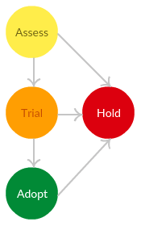

# Agora: Moda Operandi's Technical Standards Forum
Per [Wikipedia](https://en.wikipedia.org/wiki/Agora), _the agora was a central public space in ancient Greek city-states. The literal meaning of the word is "gathering place" or "assembly". The agora was the center of the athletic, artistic, spiritual and political life of the city._ Within Moda Tech, the Agora is the public center of technological discussion.

The goal of the Agora is to make it transparent what technological decisions Moda Tech is making, and why. One of the main points of this repo is the [technical recommendations](recommendations) section, which follows the same format as the [Thoughtworks Technology Radar](https://www.thoughtworks.com/radar). The recommendations are grouped based on top-level concern ([AWS](recommendations/AWS.md), [microservices](recommendations/microservices.md), [datastores](recommendations/datastores.md), etc) and broken out into four general categories: *Techniques*, *Tools*, *Platforms*, and *Languages & Frameworks*. Where it gets interesting is the [lifecycle](#technology-radar-lifecycle) that recommended technologies pass through.

Please view the [full Radar](https://radar.thoughtworks.com/?sheetId=https%3A%2F%2Fraw.githubusercontent.com%2FModaOperandi%2Fagora%2Fmaster%2Fcsv%2Fall.csv) or [invididual subsections](recommendations).

## Contributing
After adding new items, please run [bin/make-csvs.sh](bin/make-csvs.sh) locally and commit the resultant CSVs. You will need Python and markdown2 (`pip install markdown2`) installed locally.

## Technology Radar lifecycle
Recommended technologies will naturally pass through a lifecycle as they get introduced to Moda Tech and are either adopted widely or decided against. The lifecycle is as follows:

1. Assess: Worth exploring with the goal of understanding how it will fit at Moda - does it solve a new problem or improve an existing one? This is generally where technology recommendations should begin, specifically as non-prod proof-of-concepts or one-off features that can be easily turned off and/or torn down. Technologies would then naturally move either into `Trial` (successful PoC) or `Hold` (major concerns or not the right choice for Moda).

3. Trial: Worth pursuing. It is important to understand how to build up this capability. There is still a lot of risk as the technology is not yet fully supported by teams at Moda. Good candidates are prod-level features that are not part of the core experience and can be turned off without greatly affecting the end user. Once Moda has gained experience with this technology, it can move to wider `Adopt`ion; if the technology proves too complicated/difficult or doesn't serve a unique purpose, Moda should `Hold` and do its best to remove the technology. In theory, its footprint should be small enough that this is a reasonable task.

3. Adopt: We feel strongly that the we should be using these technologies. Use them when appropriate on your projects. That said, we learn about technologies through prod experience over time and there will be some that we start recommending against. If this happens, Moda will move them to `Hold`, stop using them going forward, and begin deprecating their existing use. If their presence is wide and/or difficult to remove, we will be opportunitic in identifying the right time to remove them.

4. Hold: Proceed with caution before introducing new reliance on the technology. Something may be on hold for a variety of reasons:

	* The technology is being explicitly deprecated
	* The vendor of the technology has issued a replacement (eg., Objective-C vs. Swift)
	* Previous use of the technology at Moda has failed in some way

Depending on your personal attitude and the needs of your project you can either stick to a stack of adopted technologies or experiment.

If you feel that something is not listed here but should be - [submit a pull request](CONTRIBUTING.md).

## How to use this
The conversation here in Agora can be used as a reference in all aspects of the development lifecycle, most prominently in the production of and feedback given to RFCs. Please refer to the [Moda Tech RFC process](https://github.com/ModaOperandi/rfc) for more details.

## Agora Council
Though anyone in Moda Tech can contribute to the conversation here in the Agora, this conversation should be led - and decisions approved by the [Agora Council](COUNCIL.md).

## Guilds
Sometimes there are cross-cutting concerns that can't be driven by a single team. To manage specific architecture decisions/refinements in these areas, Moda Tech will use the concept of Guilds. We will refine the role of Guilds over time, but as an initial entrypoint people can opt-in to Guilds using [Github teams](https://github.com/orgs/ModaOperandi/teams?query=guild); these then help in the [RFC process](https://github.com/ModaOperandi/rfc).

## Sources
We are indebited to deep thinking done by strong engineers that came before us, specifically Gilt's [standards](https://github.com/gilt/standards)/[Arch Board](https://github.com/gilt/arch-board) and Flow's [standards](https://github.com/flowcommerce/standards).
