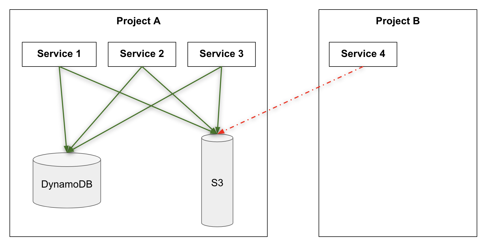

# Introduction

This is recommendation for organizing code of infrastructure related to EKS microservices. Per other recommendation infrastructure as code is done in terraform.
This document discusses only infrastructure outside of running service, thuse everything related to deployment of service to EKS is not considered to be infra.

# Criterias

1. Code of infrastructure could be stored and built
    1. together with service code
    2. outside of service code repo

2. Permissions to infra:
    1. globally open to all services in the account.
    2. open for "ownning" service and restricted to rest of services
    3. open for group of services and restricted for rest of services.

3. Permissions:
    1. might be expressed explicitly - every resource that needs to be accessed by a service should be requested in some form to setup IAM roles etc.
    2. might be implicit based on infra "ownership": service owning infra automatically gets highest permissions, all other services have to request explicitly. If infra "owner" is a groups of services then all of them get highest permissions implicitly.

# Recommendation

Current platform implementation intriduces concept of "project". Project is a logical grouping of services. Project might have infrastructure, project is "owner" of infrastructure.



Project infrastructure is stored in a separate repository. This repository has standard CI/CD workflow provided. All resources are defined with help of modules maintained by DevOps team:
```
module dynamodb_cart_consumer {
  source = "./tf-modules-infra/dynamodb-table"

  env     = terraform.workspace
  owner   = var.owner            # <- this might go away
  project = var.project          # <- project infra belongs to
  purpose = "cart-consumer"

  partition_key = "leaseKey"

  attributes = {
    "leaseKey" = "S"
  }
}
```

Every service when deployed to the platform (EKS) is deployed to sepcific project:

```
service: &service
  service:      braze-data-uploader
  project:      marketing-email
  service-type: cron-job
```

All services in the project have read/write accesss to all resources in the project automaticaly - no need to manage permissions for specific services.


Since queues are transport they are accessible for consuming for all services and accessible for producing only from specific project queue is defined in.