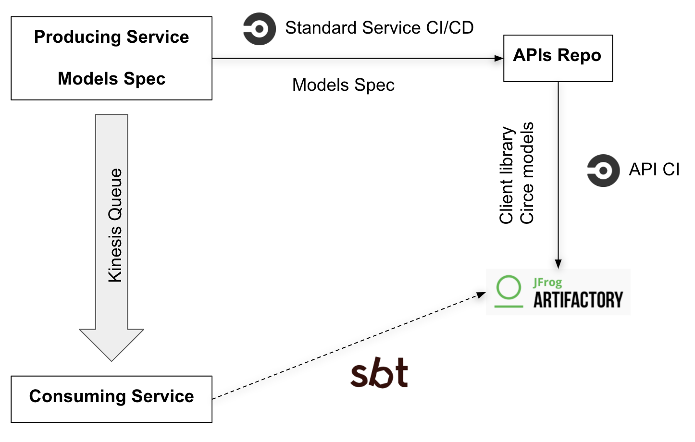

# Introduction
[Radar](https://radar.thoughtworks.com/?sheetId=https%3A%2F%2Fraw.githubusercontent.com%2FModaOperandi%2Fagora%2Fmaster%2Fcsv%2Fefficiency.csv)

This is a set of recommendations for developing queue-based services. Queue-based services are services either producing or consuming messages from queue (most often Kinesis). For simplicity of this document even if service has some HTTP-based API but it's also producing/consuming to/from some queue it's still queue-based service.

## Requirements

1. Queue producer and consumer are typically separate services. They both rely on schema of the queue message. Schema is expressed in form of models types in programming language. Such set of of model types should be shared between producer and consumer. Creation and maintenance of such models libraries should be well supported.
2. Producer and consumer might be built on different technology stacks - in Scala there are two approaches currently actively used: akka-based and fs2-based. Both approaches should be maintained.
3. Messages on a queue might have non-sense schema. This is typically the case for 3rd party producers or producers out of control (binlog). Such cases usually require custom serialization/deserialization support. It would be great to have full support for developing services for such queues.

# Languages & Frameworks

### Circe

Circe Scala library is suggested library for models serialization/deserialization. It works well for all kind of data structures and data types. Both akka and fs2 can work fine with circe models.

It's possible to develop models types that are serializable with Circle but do not depend on Circe, although when it comes to serialization/deserialization there can't be ambiguity in how type is converted to/from JSON format. There should be at least one "standard" way of such conversion with possible alternative "custom" ways. This one "standard" serialization format should be provided along models types thus linking circe configurations (settings, encoders and decoders) with models types.

# Tools

### Spec

Spec is a speicification format that allows to describe models and http endpoints. There's a codegen tool for spec format. It's suggested to use spec only for generating models types in case of queue-based services.

Spec model:

```
OrderCreatedEvent:
  id: uuid
  sku: uuid
  quanitiy: int

OrderShippedEvent:
  id: uuid
  shipped_timestamp: datetime

OrderCancelledEvent:
  id: uuid

OrderEvent:
  oneOf:
    created: OrderCreatedEvent
    shipped: OrderShippedEvent
    cancelled: OrderCancelledEvent
```

Producer holds ownership over models specification, models used in producer service are generated by producer service build tool (SBT). Models library used on consumer side is not technically the same library as used on producer side, though model types are identical.

Pros:
1. Unified definitions of models with "standard" serialization/deserialization format.
2. API observability - spec is more readable then models in code.
3. Ability to add producers/consumers in other languages.
4. Allows have most minimal dependency between producer and consumer - by schema only. Removing "jar hell" as there's no common jar dependency between producer and consumer.

Cons:
1. Spec is not programming language - it does not allow a lot of customizations of serialization/deserialization. Though custom encoders/decoders might be still hand-coded.
2. It is some additional format developers need to know.


### API CI Pipeline

API CI pipeline allows to move out client libraries maintenance from producer source codebase. Instead producer maintains only models spcification. Models specification is used in producer source code for models generation. Also models specification is published into specifications repository where it's picked up by API CI for generating client library.

Here's diagram of models specification workflow:



API CI pipeline produces versioned client library with respect to spec versions. This provides versioning for queue messages schemas.

### Goldfish

When starting new service either akka or fs2 producer/consumer code could be scaffolded. Scaffolded code is not maintained by any tool (opposite to generated code) - once generated service developers are responsible for maintenaning it. Goldfish command line tool is intended for such kind of scaffolding as it's capable of creating unified CI/CD pipeline and everything required to deploy scaffolded services into the platform.

Scaffolding service code, besides models types, allows to support both akka and fs2 based approaches. Code that is needed to produce/consume queue messages is relatively small compared to models types definitions.