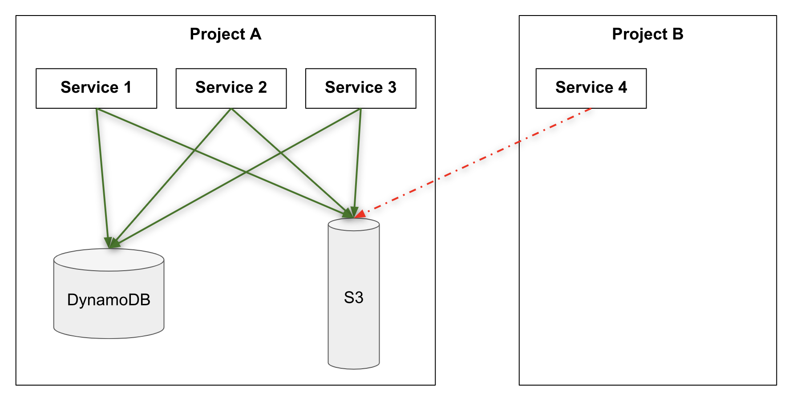

# Introduction

This is recommendation for organizing code of resources related to EKS microservices.
This document discusses only resources that are required for services, such as: DynamoDB storage, S3 storage or Kinesis queue.


# Recommendation

1. Terraform seems to be de facto standard for all infrastructure at Moda hence terraform should be used for provisioning services resources as well.
2. Modifications to resources happen less often then modifications to code. Applying changes to resources require reviewing the plan in Terraform. Splitting resources CI/CD pipelines from service CI/CD pipeline seems to be reasonable.
3. Every repository with resources should have standard CircleCI CD pipeline provided by DevOps.
4. To avoid describing permissions from service to every needed resource project could be used. Project is a logical grouping of services. Project might have resources in this case project is the "owner" of resources. 



All resources for project are defined with help of modules maintained by DevOps team:
```
module dynamodb_cart_consumer {
  source = "./modules/dynamodb-table"

  env     = terraform.workspace
  project = var.project          # <- project resource belongs to
  purpose = "cart-consumer"

  partition_key = "leaseKey"

  attributes = {
    "leaseKey" = "S"
  }
}
```

Every service when deployed to the platform (EKS) is deployed to sepcific project:

```
service: &service
  service:      braze-data-uploader
  project:      marketing-email
  service-type: cron-job
```

All services in the project have read/write accesss to all resources in the project automaticaly - no need to manage permissions for specific services.


Since queues are transport they are accessible for consuming for all services and accessible for producing only from specific project queue is defined in.